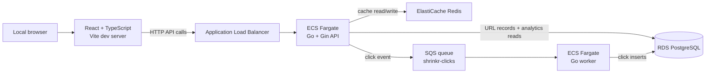
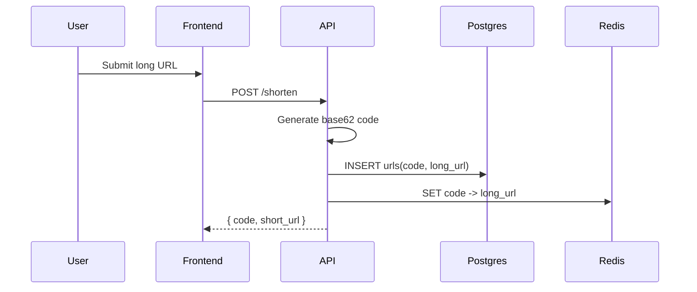
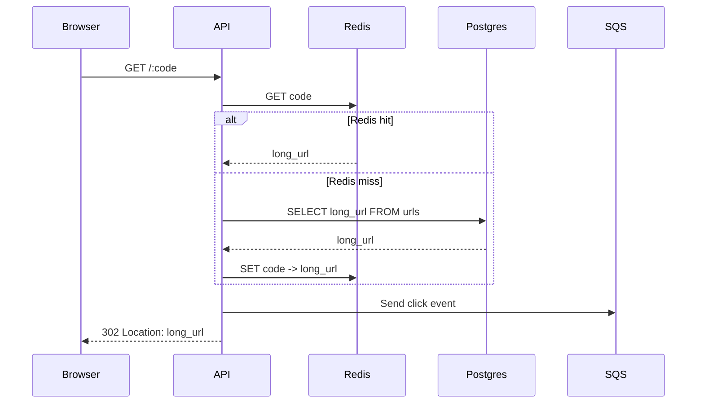
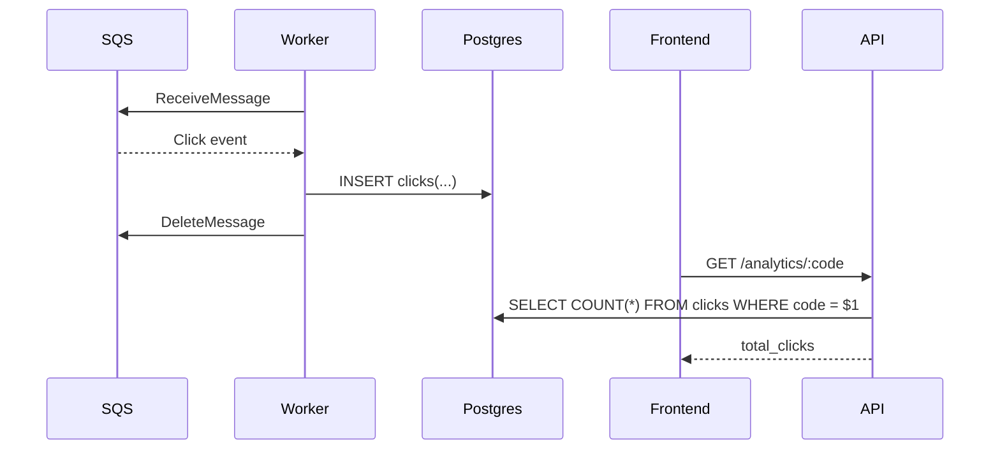
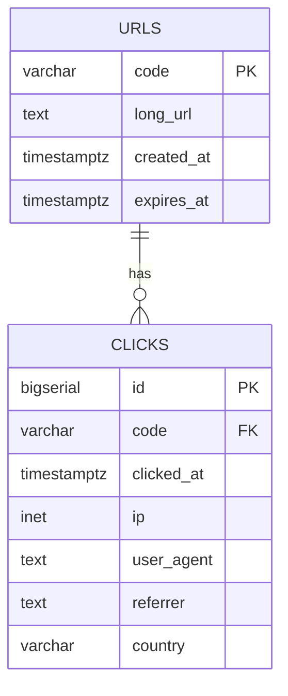
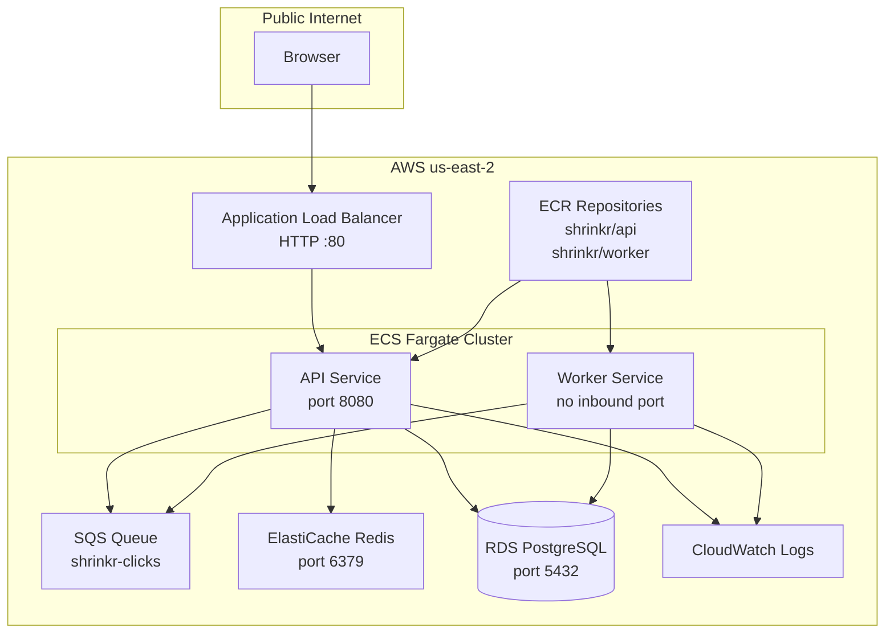

# Shrinkr

Shrinkr is a distributed URL shortener built with a Go API, a Go analytics worker, Redis caching, PostgreSQL persistence, SQS eventing, and a React TypeScript dashboard.

The current deployment is intentionally partial: the frontend runs locally, while the backend stack runs on AWS.

## Current Deployment Shape



## Tech Stack

| Component | Technology |
| --- | --- |
| API server | Go + Gin |
| Worker | Go |
| Frontend | React + TypeScript + Vite |
| URL cache | AWS ElastiCache Redis |
| Persistent storage | AWS RDS PostgreSQL |
| Event queue | AWS SQS |
| Compute | AWS ECS Fargate |
| Container registry | AWS ECR |
| Load balancing | AWS Application Load Balancer |
| Local orchestration | Docker Compose |
| Kubernetes scaffolding | Kubernetes manifests + Helm chart |

## Service Responsibilities

### API Service

The API service owns the public HTTP contract.

Endpoints:

| Method | Path | Purpose |
| --- | --- | --- |
| `GET` | `/healthz` | Health check for ALB/ECS |
| `POST` | `/shorten` | Create a short URL |
| `GET` | `/:code` | Redirect short code to original URL |
| `GET` | `/analytics/:code` | Read click count |

Core responsibilities:

- Validate input URLs.
- Generate random base62 short codes.
- Store `code -> long_url` mappings in PostgreSQL.
- Cache mappings in Redis.
- Resolve redirects through Redis first, then PostgreSQL on cache miss.
- Publish click events to SQS when SQS is enabled.
- Fall back to direct PostgreSQL click inserts when SQS is disabled for local development.
- Return CORS headers for local frontend access.

### Worker Service

The worker service is a background consumer.

Core responsibilities:

- Long-poll SQS for click events.
- Decode click event payloads.
- Insert click rows into PostgreSQL.
- Delete SQS messages only after successful processing.

The worker does not expose an HTTP port and does not need inbound network access.

### Frontend

The frontend is currently not deployed to AWS. It runs locally with Vite and calls the deployed API through the ALB.

Local frontend environment:

```env
VITE_API_BASE=http://<alb-dns-name>
```

Example:

```env
VITE_API_BASE=http://shrinkr-api-sg-1148495529.us-east-2.elb.amazonaws.com
```

## Request Flow

### Create Short URL



### Redirect



### Analytics Processing



## Data Model



### `urls`

Stores canonical short-code mappings.

```sql
CREATE TABLE IF NOT EXISTS urls (
    code        VARCHAR(16) PRIMARY KEY,
    long_url    TEXT NOT NULL,
    created_at  TIMESTAMPTZ NOT NULL DEFAULT NOW(),
    expires_at  TIMESTAMPTZ
);
```

### `clicks`

Stores redirect events consumed by the worker.

```sql
CREATE TABLE IF NOT EXISTS clicks (
    id          BIGSERIAL PRIMARY KEY,
    code        VARCHAR(16) NOT NULL REFERENCES urls(code) ON DELETE CASCADE,
    clicked_at  TIMESTAMPTZ NOT NULL DEFAULT NOW(),
    ip          INET,
    user_agent  TEXT,
    referrer    TEXT,
    country     VARCHAR(2)
);
```

## Cache Design

Redis is used as a read-through cache for redirects.

Current behavior:

- `POST /shorten` writes the mapping to PostgreSQL and attempts to cache it in Redis.
- `GET /:code` reads Redis first.
- On Redis miss, the API reads PostgreSQL and repopulates Redis.
- Redis cache failures are logged and do not block redirect behavior once PostgreSQL can resolve the code.

Current cache key shape:

```text
<code> -> <long_url>
```

Potential improvement:

```text
url:<code> -> <long_url>
```

## Event Design

Click events are JSON messages sent to SQS.

Payload shape:

```json
{
  "code": "AfKAsm",
  "timestamp": "2026-05-09T15:00:00Z",
  "ip": "203.0.113.10",
  "user_agent": "Mozilla/5.0",
  "referrer": "http://localhost:5173"
}
```

The API sends the event asynchronously during redirect. The worker inserts the click and deletes the SQS message only after the database write succeeds.

## AWS Architecture



## Security Groups

Recommended security group rules for the deployed backend:

| Security group | Inbound |
| --- | --- |
| ALB security group | HTTP `80` from `0.0.0.0/0` |
| API task security group | TCP `8080` from ALB security group |
| Worker task security group | No inbound rules required |
| RDS security group | PostgreSQL `5432` from API/worker task security group |
| Redis security group | TCP `6379` from API task security group |

Outbound can be left as all traffic for this demo deployment so tasks can reach AWS APIs, RDS, Redis, and CloudWatch.

## Configuration

### API Environment Variables

| Variable | Purpose |
| --- | --- |
| `HTTP_PORT` | API listen port, usually `8080` |
| `POSTGRES_DSN` | PostgreSQL connection string |
| `REDIS_ADDR` | Redis host and port |
| `REDIS_PASSWORD` | Redis password, empty when auth is disabled |
| `AWS_REGION` | AWS region, currently `us-east-2` |
| `SQS_QUEUE_URL` | SQS queue URL |
| `BASE_SHORT_URL` | Public base URL returned in `/shorten` responses |
| `CORS_ALLOWED_ORIGINS` | Comma-separated list of allowed browser origins |
| `SHORT_CODE_BYTES` | Length for generated short codes |

### Worker Environment Variables

| Variable | Purpose |
| --- | --- |
| `POSTGRES_DSN` | PostgreSQL connection string |
| `AWS_REGION` | AWS region |
| `SQS_QUEUE_URL` | SQS queue URL |
| `SQS_BATCH_SIZE` | SQS max messages per poll |
| `SQS_WAIT_TIME_SECONDS` | SQS long-poll wait time |

## Local Development

Start local Redis, PostgreSQL, and LocalStack:

```sh
docker compose up -d redis postgres localstack
```

Run API locally:

```sh
./scripts/run-api-local.sh
```

Run worker locally:

```sh
./scripts/run-worker-local.sh
```

Run frontend locally:

```sh
cd frontend
npm install
npm run dev
```

For the partial cloud deployment, only the frontend needs to run locally:

```sh
cd frontend
npm run dev
```

`frontend/.env.local` should point to the deployed ALB:

```env
VITE_API_BASE=http://<alb-dns-name>
```

## Deployment Notes

### ECR Images

Build and push API:

```sh
docker build --platform linux/amd64 -t shrinkr/api:latest -f api/Dockerfile api
docker tag shrinkr/api:latest "$AWS_ACCOUNT_ID.dkr.ecr.$AWS_REGION.amazonaws.com/shrinkr/api:latest"
docker push "$AWS_ACCOUNT_ID.dkr.ecr.$AWS_REGION.amazonaws.com/shrinkr/api:latest"
```

Build and push worker:

```sh
docker build --platform linux/amd64 -t shrinkr/worker:latest -f worker/Dockerfile worker
docker tag shrinkr/worker:latest "$AWS_ACCOUNT_ID.dkr.ecr.$AWS_REGION.amazonaws.com/shrinkr/worker:latest"
docker push "$AWS_ACCOUNT_ID.dkr.ecr.$AWS_REGION.amazonaws.com/shrinkr/worker:latest"
```

The `--platform linux/amd64` flag is important when building from Apple Silicon machines for ECS task definitions using `Linux/X86_64`.

### ECS

Current ECS services:

- `shrinkr-api-service`
- `shrinkr-worker-service-*`

The API service is fronted by an ALB and target group health checks use:

```text
/healthz
```

The worker service has no load balancer and runs one long-lived SQS consumer task.

## Operational Checks

API health:

```sh
curl http://<alb-dns-name>/healthz
```

CORS preflight:

```sh
curl -i -X OPTIONS \
  "http://<alb-dns-name>/shorten" \
  -H "Origin: http://localhost:5173" \
  -H "Access-Control-Request-Method: POST" \
  -H "Access-Control-Request-Headers: content-type"
```

Expected:

```text
HTTP/1.1 204 No Content
Access-Control-Allow-Origin: http://localhost:5173
```

Analytics:

```sh
curl http://<alb-dns-name>/analytics/<code>
```